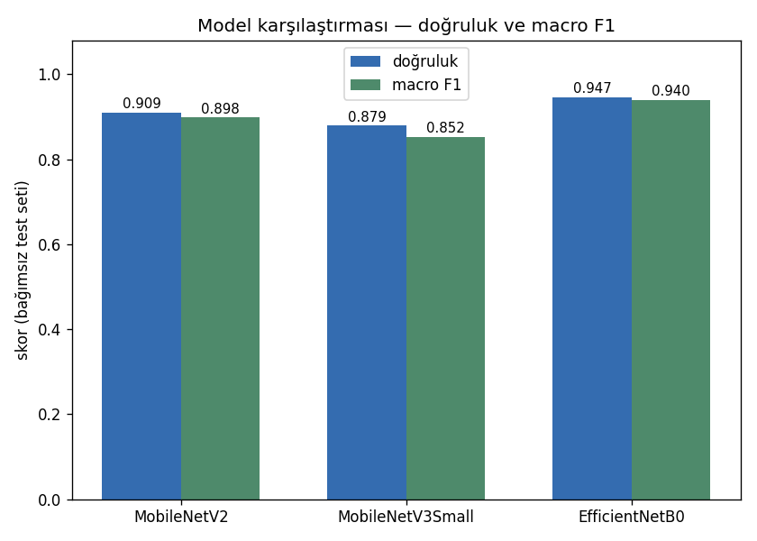
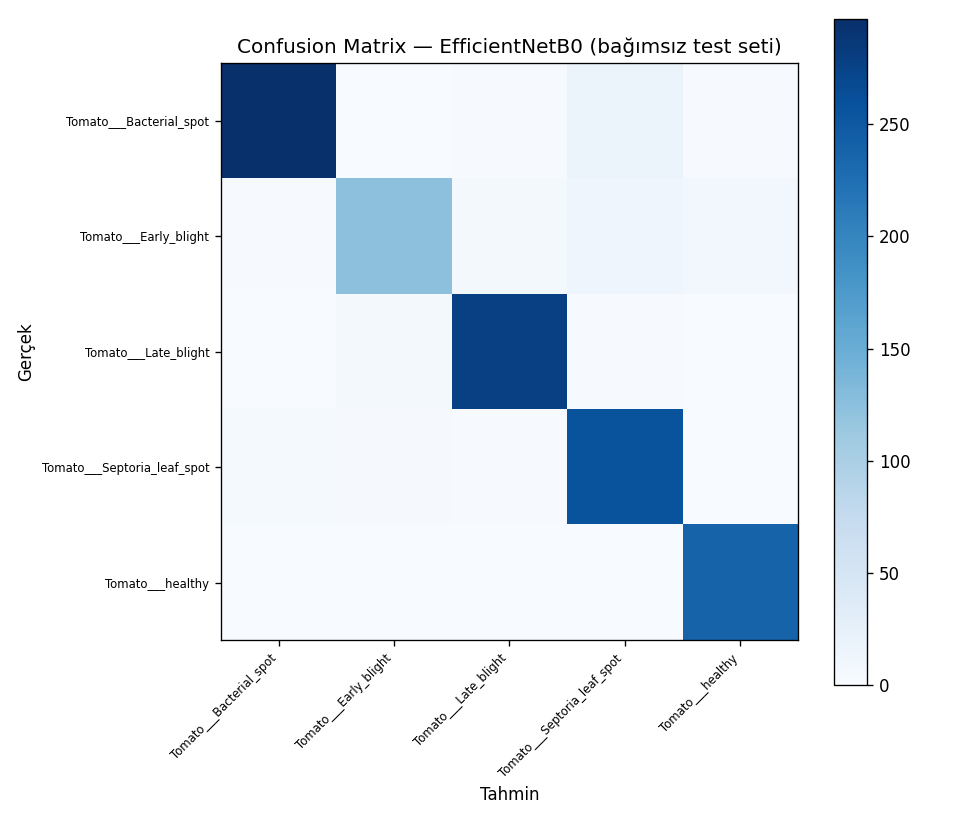
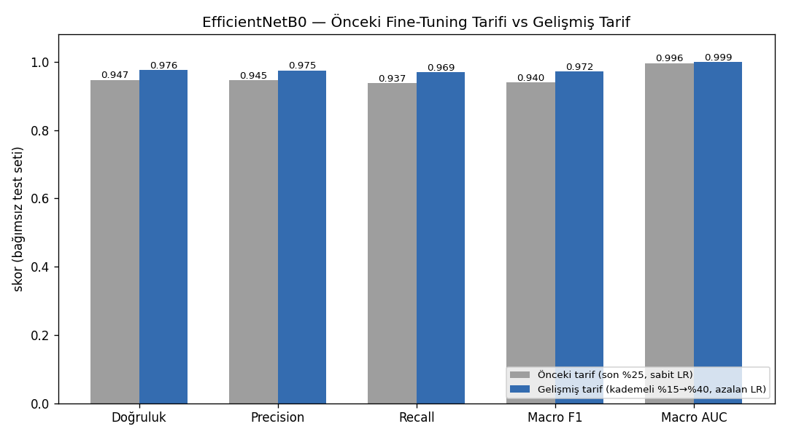
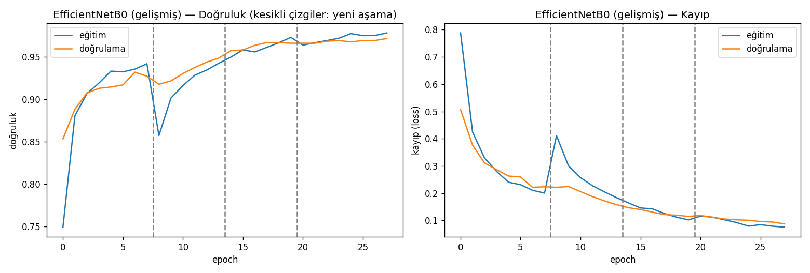
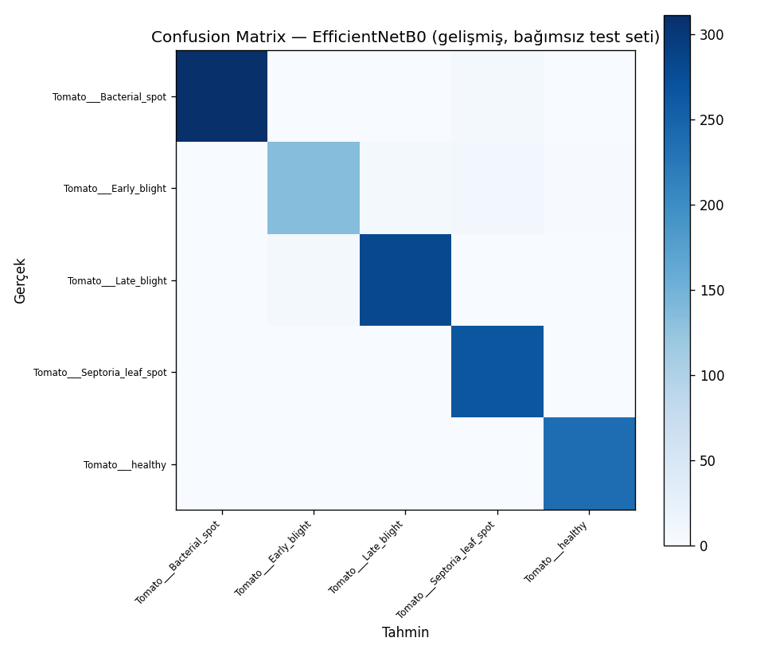

# LeadLeaf AI — Rapor Taslağı

> Bu dosya Gün 9'da tamamlanacak asıl rapora zemin olsun diye, gerçek Colab sonuçları elde edilir
> edilmez (2026-09-19) yazılmaya başlandı. Şu an **CNN/transfer learning temelleri (2.) ve model
> eğitimi/karşılaştırma (3.)** bölümleri dolu; giriş (1.), n8n/Telegram akışı, RAG, sunum bölümleri
> Gün 5-9 ilerledikçe eklenecek. Bkz. `PROGRESS.md` güncel durum için.

---

## 2. CNN ve Transfer Learning — Sıfırdan Anlatım

> Bu bölüm, projedeki derin öğrenme kısmını daha önce hiç görmemiş ya da unutmuş biri için
> **en temelden** anlatıyor — "CNN nedir"den başlayıp bizim gerçek kodumuzdaki (`notebooks/01_train_model_colab.py`)
> her karara kadar iniyor. Amaç: jüri/mülakat/sunumda "bunu neden böyle yaptın" sorusuna, ezber
> değil gerçek anlayışla cevap verebilmek.

### 2.1 Bir görüntü bilgisayara nasıl görünür?

Bize bir fotoğraf renkli bir resim gibi görünür. Bilgisayara ise **sadece sayılar** olarak görünür:
224×224 pikseldik bir domates yaprağı fotoğrafı, bilgisayar için `224 × 224 × 3` boyutunda bir sayı
tablosudur — 3, kırmızı/yeşil/mavi (RGB) kanalı temsil eder, her piksel 0-255 arası bir parlaklık
değeridir. Modelin "gördüğü" şey budur: yaklaşık 150.000 tane 0-255 arası sayı.

### 2.2 Convolution (Evrişim) Katmanı — CNN'in Temel Yapı Taşı

Bu kadar çok sayıyı doğrudan bir karar mekanizmasına vermek (örn. "bu hasta mı değil mi") verimsiz
ve gereksiz olurdu. **Convolutional Neural Network (CNN)**, görüntüyü önce **küçük parçalar
hâlinde tarayarak** özellik çıkarır: kenar, köşe, doku gibi basit örüntüler.

Bunu yapan katman **Convolution (evrişim)** katmanıdır. Küçük bir sayı matrisi (**filtre/kernel**,
genelde 3×3) görüntünün üzerinde gezdirilir; her durduğu yerde, altındaki piksellerle **eleman
eleman çarpılıp toplanır** — çıkan tek sayı, o bölgenin bir özelliğini (örn. "burada dikey bir kenar
var mı") temsil eder. Bu işlem görüntünün her yerinde tekrarlanınca **öznitelik haritası (feature
map)** ortaya çıkar.

- Filtrenin kaç piksel kayarak ilerlediğine **stride** denir. Stride arttıkça çıktı küçülür (daha
  ucuz hesap, ama detay kaybı).
- Görüntünün kenarındaki piksellerin merkezdekiler kadar "işlem görmesi" için kenarlara sahte sıfır
  değerler eklenebilir — buna **padding** denir.
- Filtrenin içindeki sayılar **rastgele başlar** ve eğitim sırasında geri yayılım (backpropagation)
  ile güncellenir — yani "kenar bulmayı" ya da "doku bulmayı" kimse elle öğretmez, model kendi keşfeder.

### 2.3 Pooling Katmanı

Convolution katmanlarından çıkan öznitelik haritaları hâlâ büyük. **Pooling** (genelde
**MaxPooling**: küçük bir pencuredeki en büyük değeri alıp gerisini atmak) bu haritayı küçültür —
en × boy iner ama **kanal sayısı değişmez**. Bu hem hesabı ucuzlatır hem modeli küçük kaymalara
(görüntü 1-2 piksel kaysa da aynı kararı vermesi) karşı dayanıklı yapar.

Klasik bir CNN, bu ikisini (Convolution → ReLU aktivasyon → Pooling) art arda tekrarlar, sonunda
**Flatten** (matrisi tek bir uzun vektöre seren, kendi ağırlığı olmayan bir katman) ile **Dense**
(tam bağlantılı) katmanlara bağlanır, en sonda **Softmax** ile her sınıf için bir olasılık üretir.

### 2.4 Neden Sıfırdan Eğitmek Yerine Transfer Learning?

Yukarıdaki mimariyi **sıfırdan** eğitmek, milyonlarca görüntü ve günlerce GPU zamanı ister —
bizim 5 sınıflık, birkaç bin görüntülük veri setimizle sıfırdan eğitilen bir CNN, kenar/doku gibi
temel örüntüleri yeterince görmeden ezberlemeye (overfitting) meyilli olurdu.

**Transfer learning**, bu sorunu şöyle çözer: ImageNet gibi 1 milyondan fazla görüntü içeren dev bir
veri setinde önceden eğitilmiş, kenar/doku/şekil gibi genel-geçer özellikleri zaten öğrenmiş bir
modeli (**MobileNetV2, MobileNetV3Small, EfficientNetB0**) alıp, kendi problemimize
**uyarlıyoruz**. Bu genel öznitelik-çıkarma bilgisi bizim probleme de (yaprak fotoğrafı da bir
görüntüdür sonuçta) büyük ölçüde aktarılabilir.

### 2.5 Gövde (Backbone) / Kafa (Head) Ayrımı

Her sınıflandırma ağı kavramsal olarak ikiye ayrılır:

- **Gövde (backbone):** Bütün convolution/pooling katmanları — işi öznitelik çıkarmak, probleme
  bağımlı değil, **devredilebilir**.
- **Kafa (head):** Sondaki Dense katman(lar)ı — işi karar vermek, ImageNet'in 1000 sınıfına göre
  ayarlı, **devredilemez** (biz 5 sınıf istiyoruz, 1000 değil).

Keras'ta bunu ayıran tek parametre `include_top=False`'tur — modeli bu şekilde çağırınca SADECE
gövde gelir, biz kendi kafamızı (`GlobalAveragePooling2D → Dropout → Dense(5, softmax)`) ekleriz.
Kod karşılığı `notebooks/01_train_model_colab.py`'deki `model_kur()` fonksiyonu.

### 2.6 Karşılaştırdığımız 3 Mimari Ne Farklı?

| Mimari | Öne çıkan özelliği | Bizim sonucumuzdaki yeri |
|---|---|---|
| **MobileNetV2** | Mobil/edge cihazlar için tasarlanmış, "depthwise separable convolution" ile az parametreyle çalışır | Orta doğruluk (%90.95), orta boyut (22 MB) |
| **MobileNetV3Small** | MobileNetV2'nin daha da küçültülmüş, NAS (Neural Architecture Search) ile optimize edilmiş hâli | En küçük (9.65 MB) ama en düşük doğruluk (%87.94) |
| **EfficientNetB0** | Derinlik/genişlik/çözünürlüğü birlikte, dengeli şekilde ölçekleyen (compound scaling) bir tasarım | En yüksek doğruluk (%94.68), en büyük model (36.76 MB) |

Üçü de "az parametreyle iyi doğruluk" hedefleyen modern mimariler — 2012'nin AlexNet'i ya da
2014'ün VGG'si gibi devasa (60-140 milyon parametreli) modeller değiller. Bu yüzden üçü de bizim
gibi sınırlı veri/hesap kaynağı olan bir bootcamp projesine uygun adaylar.

### 2.7 İki Aşamalı Eğitim Tarifi — Neden Bu Sıra?

Kodumuzda (`notebooks/01_train_model_colab.py`, ana eğitim döngüsü) her model **iki aşamadan**
geçiyor:

**Aşama 1 — Kafayı eğit:** Gövde tamamen dondurulur (`base.trainable = False`), sadece yeni eklenen
Dense katmanı `Adam(1e-3)` ile eğitilir. **Neden önce bu:** kafa henüz rastgele ağırlıklarla
başladığı için, eğer gövdeyi de aynı anda açsaydık, kafadan gelen büyük/anlamsız gradyanlar geri
yayılıp gövdenin ImageNet'te öğrendiği değerli ağırlıkları bozardı. Önce kafanın "makul" bir
duruma gelmesi gerekir.

**Aşama 2 — İnce ayar (fine-tuning):** Gövdenin son bir kısmı açılır (`base.trainable = True`,
sonra ilk katmanlar tekrar donduruluyor), öğrenme oranı **100 kat düşürülür** (`1e-3` → `1e-5`) ve
model **yeniden derlenir** (`model.compile(...)` — bu adım atlanırsa `trainable` değişiklikleri
geçerli olmaz). **Neden düşük öğrenme oranı:** yüksek oranla açarsak, birkaç adımda ImageNet'te
öğrenilmiş değerli ağırlıklar silinir — hazır ağırlıkla başlamanın hiçbir anlamı kalmaz.

**Neden sadece SON kısmı açıyoruz, hepsini değil:** Gövdenin ilk katmanları çok genel özellikler
(kenar, renk geçişi) öğrenir — bunlar hemen her görüntü probleminde işe yarar, dokunmaya gerek yok.
Son katmanlar ise ImageNet'in 1000 sınıfına özel, daha soyut özellikler öğrenir — bizim 5 sınıfımıza
uyarlanması gereken kısım burasıdır.

### 2.8 BatchNormalization Tuzağı ve Çözümümüz

Bu, en sık gözden kaçan hatalardan biri: `base.trainable = True` yapıldığında, gövdenin içindeki
**BatchNormalization** katmanları da "eğitilebilir" hâle gelir ve kendi hareketli
ortalama/varyans istatistiklerini bizim **küçük batch'imize** göre güncellemeye başlar — bu,
modelin ImageNet'te öğrendiği istatistikleri bozar, hata vermeden sessizce kötüleştirir.

Bizim çözümümüz: `model_kur()` içinde gövdeyi `base(x, training=False)` şeklinde çağırıyoruz. Bu,
gövdenin BatchNormalization katmanlarını **her zaman** çıkarım (inference) modunda tutar — `layer.trainable`
ayarı ne olursa olsun, bu katmanlar kendi istatistiklerini asla bizim küçük verimize göre
güncellemez. (Alternatif bir çözüm, katmanları tek tek `isinstance(layer, BatchNormalization)`
kontrolüyle dışarıda bırakmaktır — ikisi de aynı amaca hizmet eder, biz ilkini seçtik çünkü kod
daha az yer kaplıyor ve unutulma riski yok.)

### 2.9 Aşırı Öğrenmeyi (Overfitting) Önleyen İki Mekanizma

- **Veri artırma (augmentation):** `yeni_augment_katmani()` — eğitim sırasında her görüntüye
  rastgele yatay çevirme, hafif döndürme, yakınlaştırma, kontrast değişikliği uygulanır. Model aynı
  yaprağı hep aynı açıdan görmez, bu da ezber yerine genelleme yapmaya zorlar. **Doğrulama/test
  setinde augmentation UYGULANMAZ** — çünkü orada amacımız gerçek dünyadaki performansı ölçmek.
- **Dropout (0.2):** Eğitim sırasında, kafadaki nöronların rastgele bir kısmı (burada %20'si) her
  adımda "kapatılır" — model tek bir nörona/yola aşırı bağımlı hâle gelemez. Az veri setlerinde
  yüksek dropout (0.5+) modelin öğrenecek kadar bile bilgi göremediği bir "eksik öğrenme"
  (underfitting) durumuna yol açabilir — biz bu yüzden düşük (0.2) tuttuk.

### 2.10 Train / Valid / Test Ayrımı — Neden 3 Ayrı Küme?

Veriyi stratified olarak **%70 train / %15 valid / %15 test** olarak üçe bölüyoruz
(`_stratified_uc_yonlu_split`, `split_manifest.json`'a kaydediliyor):

- **Train (eğitim):** Modelin ağırlıklarını güncellemek için kullandığı veri.
- **Valid (doğrulama):** Eğitim SIRASINDA, her epoch sonunda modelin ne kadar iyi genelleştiğini
  ölçmek için — `EarlyStopping` ve `ReduceLROnPlateau` gibi kararlar bu kümeye bakarak verilir.
  Model bu veriyi **doğrudan** öğrenmez ama dolaylı olarak (hangi epoch'ta durulacağı, öğrenme
  oranının ne zaman düşeceği gibi kararlar üzerinden) bu kümeye "uyum sağlar".
- **Test:** Eğitim ve tüm karar süreci BİTTİKTEN SONRA, **sadece bir kez** bakılan, tamamen
  görülmemiş küme. Raporladığımız tüm sayılar (doğruluk, macro F1, AUC) SADECE bu kümede
  hesaplanıyor (`modeli_degerlendir()`) — çünkü valid küme üzerinde ölçseydik, modelin
  valid'e "dolaylı uyum sağlamış" olması sonucu olduğundan iyimser gösterebilirdi.

**Stratified** ve **tek seferlik** olmasının nedeni: her sınıfın kendi oranında (%70/%15/%15)
bölünmesi, küçük sınıfların testte hiç kalmaması riskini ortadan kaldırır; tek seferlik + manifest
kaydı ise aynı görselin iki kümede birden bulunmasının (data leakage) **yapısal olarak imkânsız**
olmasını sağlar.

### 2.11 Değerlendirme Metrikleri — Ne Anlama Geliyorlar?

- **Accuracy (doğruluk):** Doğru tahmin edilenlerin oranı. Basit ama **dengesiz veri setlerinde
  yanıltıcı** olabilir (örn. 100 örnekten 90'ı "sağlıklı" ise, her şeye "sağlıklı" diyen bir model
  bile %90 doğruluk gösterir).
- **Precision (kesinlik):** Model "bu hastalık" dediğinde ne sıklıkla haklı çıkıyor.
- **Recall (duyarlılık):** Gerçekten o hastalığa sahip olanların ne kadarını model yakalayabiliyor.
- **F1:** Precision ve recall'un dengeli ortalaması (harmonik ortalama).
- **Macro ortalama:** Bu üçünü (P/R/F1) HER SINIF İÇİN AYRI AYRI hesaplayıp, sonra sınıfların
  büyüklüğüne bakmadan basit ortalamasını alıyoruz. Bunu tercih etmemizin nedeni: küçük bir sınıfta
  (örn. daha az örneği olan bir hastalık) kötü performans, "micro/weighted" ortalamada büyük
  sınıfların gölgesinde kaybolabilir — macro ortalama her sınıfa eşit önem verir, bu da tarımsal
  teşhiste "nadir ama önemli bir hastalığı kaçırmamak" hedefiyle örtüşür.
- **AUC (Area Under the ROC Curve):** Modelin, doğru sınıfa YANLIŞ sınıflardan daha yüksek olasılık
  verme eğilimini ölçer — accuracy'den farklı olarak, modelin verdiği **güven skorlarının
  kalitesini** de değerlendirir. "One-vs-rest" (her sınıfı diğerlerine karşı) + macro ortalama ile
  hesaplandı (`roc_auc_score(..., multi_class="ovr", average="macro")`).

### 2.12 Açıklanabilirlik — "Kaç Parametre Gerçekten Eğitiliyor?"

Her aşamada `parametre_ozeti()` fonksiyonu, modeldeki **eğitilebilir** (gradyanla güncellenen) ve
**donuk** (ImageNet'teki hâliyle sabit kalan) parametre sayısını yazdırır. Bu, "black box" bir
eğitim yerine, her aşamada gerçekte ne kadarının değiştiğini somut sayıyla gösteren bir şeffaflık
katmanı — bkz. `model_comparison.csv`'deki `egitilebilir_parametre_1_asama` /
`donuk_parametre_1_asama` / `egitilebilir_parametre_2_asama` / `donuk_parametre_2_asama` kolonları.

---

## 3. Model Eğitimi ve Karşılaştırma Sonuçları

### 3.1 Yöntem

- **Veri:** PlantVillage (Kaggle, `abdallahalidev/plantvillage-dataset`, ham/HAM veri — literatürde
  bilinen "Augmented" veri setindeki train/valid sızıntı riskini önlemek için bilinçli tercih).
- **Kapsam:** 38 sınıf yerine domates + 4 yaygın hastalık (5 sınıf) — 10 günlük MVP kapsam kararı.
- **Bölme:** Sınıf bazında **stratified %70/%15/%15** train/valid/test — tek seferlik, `split_manifest.json`'da
  hangi dosyanın nereye düştüğü kayıtlı (tekrarlanabilirlik + sızıntı denetimi; aynı görsel iki
  kümede birden asla yok).
- **Karşılaştırılan 3 mimari:** MobileNetV2, MobileNetV3Small, EfficientNetB0 — ImageNet ön-eğitimli,
  `include_top=False`, her biri **kendi doğru `preprocess_input`'unu** kullanıyor (bkz. 3.4).
- **Eğitim tarifi (3 mimaride de aynı):** 2 aşamalı transfer learning —
  1. **Kafa eğitimi:** gövde tamamen donuk, `GlobalAveragePooling2D → Dropout(0.2) → Dense(softmax)`,
     `Adam(1e-3)`, 8 epoch, `EarlyStopping(patience=3, restore_best_weights=True)`.
  2. **İnce ayar (fine-tuning):** gövdenin son **%25**'i açılıyor, `Adam(1e-5)` (100× düşük öğrenme
     oranı), yeniden derleme, 5 epoch daha.
- **Değerlendirme:** SADECE bağımsız test setinde — accuracy, macro precision/recall/F1, macro AUC
  (one-vs-rest), model boyutu (MB), görüntü başına ortalama inference süresi (ms).

### 3.2 Sonuç Tablosu

| Model | Doğruluk | Macro Precision | Macro Recall | Macro F1 | Macro AUC | Boyut (MB) | Inference (ms) |
|---|---|---|---|---|---|---|---|
| MobileNetV2 | 0.9095 | 0.9022 | 0.8987 | 0.8985 | 0.9879 | 22.12 | 89.1 |
| MobileNetV3Small | 0.8794 | 0.8867 | 0.8479 | 0.8523 | 0.9866 | 9.65 | 88.6 |
| **EfficientNetB0** | **0.9468** | **0.9454** | **0.937** | **0.940** | **0.9958** | 36.76 | 91.3 |

**Üretim için EfficientNetB0 otomatik seçildi** (en yüksek doğruluk/F1/AUC; boyut farkı — 36.76 MB'a
karşı 9-22 MB — bir FastAPI cloud servisi için önemsiz, edge/mobil kısıtı yoksa). Seçim mantığı
`notebooks/01_train_model_colab.py`'de kod olarak da var: `en_iyi = max(..., key=lambda s: s["dogruluk"])`.

Bu sonuç, hazırlık aşamasında yaptığımız literatür taramasıyla (Kaggle/akademik çalışmalarda
PlantVillage/domates hastalığı sınıflandırmasında EfficientNetB0'ın ~%97 civarı, MobileNetV2'nin
daha düşük ama çok daha hafif sonuçlar verdiği) birebir örtüşüyor.

### 3.3 Confusion Matrix Bulguları

Üç modelde de köşegen baskın (genel olarak güçlü sınıflandırma). Tek dikkat çeken zayıflık:
**MobileNetV3Small'da "Tomato___Early_blight" sınıfı** diğer sınıflara göre belirgin şekilde daha
fazla karışıyor (bkz. `model/tubitak/confusion_matrix_MobileNetV3Small.png`) — bu modelin macro
recall'unun (0.8479) diğer ikisinden düşük çıkmasının doğrudan nedeni.

### 3.4 Sınırlılık — Fine-Tuning Her Mimaride Aynı Etkiyi Yapmadı

Üç modele **aynı** fine-tuning tarifi (son %25 açık, `Adam(1e-5)`) uygulandı — adil karşılaştırma
için bilinçli bir tercih. Ama öğrenme eğrilerine bakınca (`model/tubitak/ogrenme_egrisi_*.png`),
bu tarifin üç mimaride çok farklı sonuç verdiği görülüyor:

| Model | Fine-tuning etkisi (doğrulama seti) |
|---|---|
| EfficientNetB0 | **Olumlu** — doğrulama doğruluğu ~%92'den ~%93.5'e çıktı, kayıp düşmeye devam etti |
| MobileNetV2 | **Nötr** — fine-tuning öncesi/sonrası doğrulama ~%90 civarında sabit kaldı |
| MobileNetV3Small | **Olumsuz** — doğrulama doğruluğu fine-tuning öncesi zirvesi ~%93'ten ~%85'e düştü |

**Yorum:** MobileNetV3Small en küçük/en az kapasiteli gövde (1. aşamada sadece 2.885 eğitilebilir,
939.120 donuk parametre — diğer ikisinin çok altında, bkz. `model_comparison.csv`'deki
`egitilebilir_parametre_*_asama` kolonları). Son %25'ini açmak, bu küçük modelin ImageNet'te
öğrendiği temsili bozmuş görünüyor — kapasitesi zaten sınırlı bir ağda agresif fine-tuning fayda
yerine zarar veriyor. Bu, modelin bozuk olduğu anlamına gelmiyor; **"tek bir fine-tuning tarifi her
mimariye uymayabilir"** şeklinde belgelenmiş, dürüst bir sınırlılık.

Bu bulgu aynı zamanda TÜBİTAK 2204 araştırma sorusuyla ("bağlamsal genişletmeler bu güvenilirliği
nasıl etkiler") doğrudan ilişkili — gelecekte her mimari için ayrı ayrı ayarlanmış (mimariye özel
unfreeze oranı/öğrenme oranı) bir karşılaştırma yapılabilir; bu, mevcut 10 günlük MVP kapsamının
dışında, TÜBİTAK/TEKNOFEST takip aşamasına bırakıldı.

### 3.5 Model Seçimi Neden Doğru — Kısa Özet (sunum için)

- En yüksek doğruluk/F1/AUC EfficientNetB0'da.
- Fine-tuning'den **gerçekten fayda gören tek model** de EfficientNetB0 — yani seçim sadece ham
  sayıya değil, eğitim sürecinin sağlıklı işlediği modele de dayanıyor.
- Boyut farkı (36.76 MB) üretim ortamımızda (FastAPI + n8n Cloud, mobil/edge kısıtı yok) önemsiz.

### 3.6 Gelişmiş Fine-Tuning Denemesi (Sadece EfficientNetB0) — SONUÇ: BAŞARILI

> **Durum (2026-09-19):** Deney çalıştırıldı, sonuç geldi ve **üretim modeli bununla
> değiştirildi** (`model/model.keras` artık bu, aşağıdaki gelişmiş sonuç). `model_meta.json`
> hâlâ `"EfficientNetB0"` yazıyor çünkü mimari/preprocess değişmedi, sadece fine-tuning tarifi.

3.4'teki bulgu şunu gösterdi: 3 mimariye uygulanan **aynı** fine-tuning tarifi (son %25 açık, sabit
`Adam(1e-5)`, 5 epoch) EfficientNetB0'a **fayda sağladı** (doğrulama %92→%93.5). Soru: bu mimariye
özel, daha "iddialı" bir tarifle daha da iyi sonuç alınabilir mi? Bunu test etmek için SADECE
EfficientNetB0'ı, 4 değişiklikle yeniden eğitiyoruz — diğer iki modele dokunulmuyor (adil
karşılaştırma raporu 3.1-3.5 zaten tamamlandı, bu ayrı, hedefli bir ek deney):

1. **Daha uzun eğitim + daha sabırlı early stopping:** Önceki öğrenme eğrisi fine-tuning
   sonunda hâlâ hafif yukarı eğilimliydi — `patience=3` erken durdurmuş olabilir. Yeni denemede
   `patience=5`'e çıkarıldı, toplam fine-tuning epoch üst sınırı 5'ten ~20'ye çıkarıldı (early
   stopping yine de erken kesebilir, bu üst sınır sadece "izin verilen azami").
2. **Daha fazla katman açmak (%25 → %40):** EfficientNetB0 fine-tuning'e olumlu tepki verdiği
   için, gövdenin daha büyük bir kısmını probleme özel hâle getirmenin de olumlu olabileceği
   varsayımı — riski: küçük (5 sınıflık) veri setinde daha fazla parametre = daha fazla
   overfitting ihtimali.
3. **Kademeli açma (gradual unfreezing):** %40'ı tek seferde açmak yerine 3 aşamada
   (%15 → %30 → %40). Gerekçe: büyük bir kısmı bir anda açmak, "yanlış sıra" tuzağının (bkz. 2.7)
   daha yumuşak bir versiyonuna yol açabilir — her adımda daha az miktarda yeni parametre riske
   atılıyor, model her aşamada yeni açılan kısma alışma fırsatı buluyor.
4. **Fine-tuning içinde azalan öğrenme oranı:** Sabit `1e-5` yerine her aşamada
   `ReduceLROnPlateau(monitor="val_loss", factor=0.5, patience=2, min_lr=1e-7)` — doğrulama kaybı
   2 epoch iyileşmezse öğrenme oranı yarıya iniyor. Amaç: ince ayarın sonuna doğru daha küçük,
   daha hassas adımlar atmak.

**Kontrol edilen değişken:** Veri bölme `SEED=42` ile birebir aynı (`split_manifest.json` ile
üretilen train/valid/test kümeleriyle tutarlı) — yani yeni sonuç, 3.2'deki EfficientNetB0
satırıyla **doğrudan ve adil şekilde** kıyaslanabilir (farklı bir test setinde ölçülmüş "sahte"
bir iyileşme riski yok).

### 3.6.1 Sonuç Tablosu — Önceki Tarif vs Gelişmiş Tarif

| Metrik | Önceki tarif (son %25, sabit LR) | Gelişmiş tarif (kademeli %15→%40, azalan LR) | Fark |
|---|---|---|---|
| Doğruluk | 0.9468 | **0.9762** | **+0.0294** |
| Macro Precision | 0.9454 | **0.9748** | +0.0294 |
| Macro Recall | 0.937 | **0.9693** | +0.0323 |
| Macro F1 | 0.940 | **0.9716** | +0.0316 |
| Macro AUC | 0.9958 | **0.9993** | +0.0035 |
| Model boyutu (MB) | 36.76 | 31.16 | −5.6 |
| Inference (ms) | 91.28 | 89.8 | −1.5 |

**Sonuç: 4 değişikliğin hepsi birlikte gerçek, anlamlı bir iyileşme sağladı** (+2.94 puan doğruluk,
+3.16 puan macro F1) — hem de daha küçük ve daha hızlı bir modelle (checkpoint'in `restore_best_weights`
ile farklı bir epoch'ta alınmış olması boyut/hız farkının nedeni, mimari birebir aynı).

Öğrenme eğrisi, kademeli açmanın (3 kesikli çizgi = %15/%30/%40 geçişleri) tam olarak umulduğu gibi
çalıştığını gösteriyor: her geçişte küçük, kontrollü bir sıçrama var ama eğitim/doğrulama eğrileri
birbirinden hiç ayrışmıyor (overfitting yok) ve doğrulama doğruluğu 3 aşama boyunca da **istikrarlı
şekilde yükseliyor** (~%92'den ~%97'ye) — 3.4'teki "tek tarif her mimariye uymayabilir" bulgusunun
tersine, burada EfficientNetB0'a özel olarak "daha sabırlı + daha kademeli" bir tarifin gerçekten
işe yaradığı görülüyor.

Confusion matrix'te de önceki en zayıf nokta (Early_blight ↔ diğer sınıflar karışması) belirgin
şekilde azalmış.

**Uygulanan değişiklik:** `model/model.keras` bu gelişmiş modelle değiştirildi (`model_meta.json`
hâlâ `"EfficientNetB0"` — mimari aynı, sadece eğitim tarifi değişti). **Önceki (temel tarif)
EfficientNetB0 modeli kaybolmadı** — `model/tubitak/model_EfficientNetB0.keras` olarak, 3-model
karşılaştırmasının bir parçası şeklinde ayrı bir dosyada duruyor; ikisi farklı checksum'lara sahip,
üretim modelinin üzerine yazılması diğerini etkilemedi.

---

## 4. Süreç Günlüğü — Sırayla Ne Yaptık, Neden Yaptık

> Bu bölümün amacı: yukarıdaki sonuçların ARKASINDAKİ karar zincirini, hiç bilmeyen biri de
> okuyunca anlayacak şekilde, adım adım anlatmak. Jüri "neden bunu yaptın, alternatifi neydi"
> diye sorduğunda cevap burada; ayrıca ileride kod veya rapor üzerinden geçerken **kendi
> mantığımızı yeniden hatırlamak** için de bu bölüm var.

### Adım 1 — Veri setini seçme: neden "ham" veri, neden bu Kaggle kaynağı

Kaggle'da PlantVillage için birden fazla versiyon var. Bazıları önceden train/valid'e **bölünmüş
ve çoğaltılmış (augmented)** hâlde geliyor. Biz bunun yerine **ham** (bölünmemiş, çoğaltılmamış)
veriyi (`abdallahalidev/plantvillage-dataset`) tercih ettik. **Neden:** çoğaltılmış veri setlerinde,
aynı orijinal fotoğrafın döndürülmüş/kırpılmış kopyaları hem train'e hem valid'e düşebiliyor — bu
"veri sızıntısı" (data leakage), doğrulama doğruluğunu OLDUĞUNDAN İYİMSER gösterir (model aslında
"ezberlediği" bir görüntünün varyasyonunu görüyor, gerçek genelleme yeteneğini değil). Ham veriyi
KENDİMİZ bölerek, bu riski **yapısal olarak imkânsız** hâle getirdik (bkz. Adım 4).

### Adım 2 — Kapsamı daraltma: 38 sınıf yerine 5 sınıf

PlantVillage veri seti onlarca bitki ve hastalık içeriyor. Biz sadece **domates + 4 yaygın
hastalığı + sağlıklı** (5 sınıf) seçtik. **Neden:** proje 10 günlük bir bootcamp teslimi (bkz.
`PROGRESS.md`, 2026-09-11 kapsam kararı) — 38 sınıfı aynı kalitede eğitip değerlendirmek çok daha
fazla veri/süre/hesap gerektirir. Domates seçimi keyfi değil: yaygın bir sebze, hastalıkları görsel
olarak ayırt edilebilir düzeyde farklı, ve MVP'nin "gerçek bir çiftçi problemini uçtan uca çözme"
hedefine yetiyor. 38 sınıfa genişletme, `SELECTED_CLASSES = None` yaparak tek satırlık bir
değişiklik — bilerek TÜBİTAK/TEKNOFEST sonraki aşamasına bırakıldı.

### Adım 3 — Hangi 3 mimariyi karşılaştıracağımıza karar verme

Sıfırdan bir mimari tasarlamak yerine (bkz. Bölüm 2.4, transfer learning gerekçesi), hazır
mimarilerden hangilerini deneyeceğimize karar vermemiz gerekiyordu. Rastgele seçmek yerine önce
**literatür/Kaggle taraması** yaptık: PlantVillage/domates hastalığı sınıflandırmasında hangi
mimariler kullanılmış, hangileri iyi sonuç vermiş? Bulgu: **EfficientNetB0** genelde en yüksek
doğruluğu (~%97 civarı) veriyor, **MobileNetV2/V3** ailesi daha düşük ama çok daha küçük/hızlı
sonuçlar veriyor — yani bir "doğruluk vs hafiflik" dengesi var. Bu üç mimariyi seçtik ki hem bu
dengeyi kendi verimizde SOMUT olarak gösterebilelim hem de üçü de bizim kısıtlı
veri/hesap/süre bütçemize uygun, modern (2018 sonrası), az parametreli mimariler olsun — 2012'nin
AlexNet'i ya da 2014'ün VGG'si gibi 60-140 milyon parametreli devasa modeller değil.

### Adım 4 — Veriyi train/valid/test'e bölme kararı ve sızıntı önleme

Veriyi TEK SEFERDE, sınıf bazında **stratified** biçimde %70/%15/%15 böldük ve **hangi dosyanın
nereye düştüğünü** `split_manifest.json`'a kaydettik. **Neden stratified:** her sınıfın kendi
oranında bölünmesi, az örnekli bir sınıfın testte hiç kalmaması riskini ortadan kaldırır. **Neden
tek seferlik + kayıtlı:** üç modeli de AYNI train/valid/test üzerinde eğitip test etmek, aralarındaki
karşılaştırmayı adil kılar (biri "daha kolay" bir test setine denk gelmiş olmaz); manifest kaydı da
bunu istenildiğinde denetlenebilir/tekrarlanabilir kılar.

### Adım 5 — Model mimarisini kurma: gövde + kafa

Her üç model için de aynı iskeleti kullandık (`model_kur()`): `include_top=False` ile SADECE
gövdeyi (ImageNet ağırlıklarıyla) getirdik, üstüne kendi kafamızı (`GlobalAveragePooling2D →
Dropout(0.2) → Dense(5, softmax)`) ekledik. Ayrıntılı gerekçe Bölüm 2.5'te.

### Adım 6 — İki aşamalı eğitim tarifini tasarlama

Kafa önce donuk gövdeyle eğitildi (`Adam(1e-3)`), sonra gövdenin son %25'i açılıp çok daha düşük
öğrenme oranıyla (`Adam(1e-5)`) ince ayar yapıldı. Bu sırayı ve öğrenme oranı farkını NEDEN böyle
seçtiğimiz Bölüm 2.7'de detaylı anlatılıyor — kısacası: yanlış sırada (önce gövde) ya da yüksek
öğrenme oranıyla ince ayar yaparsak, ImageNet'ten gelen değerli ağırlıkları ilk birkaç adımda
siliyoruz.

### Adım 7 — BatchNormalization'ı koruma altına alma

Bu, kolayca atlanabilecek ama modeli sessizce bozabilecek bir ayrıntıydı (Bölüm 2.8). Referans
aldığımız ders materyalinde iki çözüm öneriliyordu; biz `base(x, training=False)` çağrısını
seçtik çünkü tek bir yerde, kalıcı ve unutulma riski olmayan bir çözüm.

### Adım 8 — Değerlendirme protokolünü belirleme

Her model için SADECE bağımsız test setinde (valid'de değil) accuracy, macro precision/recall/F1
ve macro AUC hesapladık — bunların ne anlama geldiği ve neden "macro" ortalama seçtiğimiz Bölüm
2.11'de. Ayrıca model boyutu (MB) ve görüntü başına ortalama inference süresini (ms) de ölçtük —
çünkü üretimde (n8n/Telegram → FastAPI) sadece doğruluk değil, "makul sürede cevap verebiliyor mu"
sorusu da önemli.

### Adım 9 — Açıklanabilirlik katmanı ekleme

`parametre_ozeti()` fonksiyonuyla her eğitim aşamasında kaç parametrenin eğitilebilir, kaçının
donuk olduğunu somut sayıyla yazdırdık ve `model_comparison.csv`'ye kaydettik. **Neden:** "black
box" bir eğitim yerine, her aşamada gerçekte ne kadarının değiştiğini göstermek — hem şeffaflık
hem de ileride "neden bu model böyle davrandı" sorularına (bkz. Adım 10) somut veriyle cevap
verebilmek için.

### Adım 10 — İlk sonuçları değerlendirme ve beklenmedik bir bulgu

Üç modeli eğitip test ettikten sonra (Bölüm 3.2), sonuçlar literatür taramasıyla örtüştü:
EfficientNetB0 en iyi, MobileNetV3Small en küçük ama en düşük doğruluklu. Ama sadece SAYILARA
bakmakla yetinmedik — **öğrenme eğrilerini de tek tek inceledik** (Bölüm 3.4) ve şunu fark ettik:
aynı fine-tuning tarifi EfficientNetB0'a fayda sağlarken, MobileNetV3Small'a (en küçük/en az
kapasiteli model) ZARAR vermiş. Bu, "sayılara bakmak yetmez, EĞİTİM SÜRECİNİ de incelemek gerekir"
şeklinde önemli bir metodolojik ders — ve doğrudan bir sonraki adımı (Adım 11) tetikledi.

### Adım 11 — Bu bulguya dayanarak hedefli bir ek deney tasarlama

EfficientNetB0 fine-tuning'den zaten fayda gördüğüne göre, ona ÖZEL, daha "iddialı" bir tarifle
daha da iyi sonuç alınabilir mi diye sorduk. Diğer iki modele DOKUNMADIK — çünkü onların
karşılaştırma raporu (adil, aynı koşullarda) zaten tamamlanmıştı; bu ayrı, hedefli bir deneydi.
4 değişikliği (daha uzun eğitim, daha fazla katman, kademeli açma, azalan öğrenme oranı) NEDEN
seçtiğimiz Bölüm 3.6'da tek tek gerekçelendirildi. Bunun için AYRI bir dosya
(`notebooks/02_efficientnetb0_gelismis_egitim.py`) yazdık — orijinal 3-model karşılaştırma
script'ine karışmasın, ikisi de bağımsız çalışabilsin diye.

### Adım 12 — Deneyi çalıştırırken çıkan iki teknik hata ve nasıl çözüldüğü

Bu adım, kodun "ilk seferde mükemmel çalışmadığını", ama hataların nasıl teşhis edilip
düzeltildiğini gösteriyor — jüri sorarsa dürüstçe anlatılabilecek gerçek bir mühendislik süreci:

1. **Keras sürüm uyumsuzluğu:** Colab'daki Keras, yerel bilgisayardaki Keras'tan (3.10.0) daha
   yeni olduğu için, kaydedilen `.keras` dosyalarının içinde yerel Keras'ın TANIMADIĞI bir
   `quantization_config` alanı vardı. Yerel `inference/app.py` bu dosyayı yüklemeye çalışınca
   `TypeError: Unrecognized keyword arguments` hatasıyla TÜM servis çöküyordu — bu da "eksik model
   demo moda düşer, servis çökmez" felsefesiyle çelişiyordu. **Çözüm:** `.keras` dosyasının aslında
   bir zip arşivi olduğunu kullanarak (`config.json` + `model.weights.h5` içeriyor), içindeki
   `config.json`'dan sadece bu fazladan alanı silen küçük bir onarım fonksiyonu
   (`_strip_quantization_config`) yazdık; bu, model ağırlıklarına ya da davranışına DOKUNMUYOR,
   sadece eski Keras'ın anlamadığı bir metadata alanını temizliyor. Ayrıca `inference/app.py`'nin
   model yükleme kısmını, hata durumunda servisi çökertmek yerine DEMO MODU'na düşecek şekilde
   daha dayanıklı hâle getirdik.
2. **`class_names` özniteliği kayboldu:** Yeni script'te, veri setini `.prefetch()` ile
   sarmaladıktan SONRA `class_names` özniteliğini okumaya çalıştık — ama `.prefetch()`'in
   döndürdüğü nesne (`_PrefetchDataset`) bu özniteliği taşımıyor, `AttributeError` verdi. **Çözüm:**
   sırayı değiştirip `class_names`'i HAM veri setinden (prefetch uygulanmadan önce) okuduk, prefetch'i
   ondan SONRA uyguladık. Orijinal `01_train_model_colab.py`'de bu sıra zaten doğruydu (bu yüzden
   orada hiç hata çıkmamıştı) — yeni dosyayı yazarken bu ayrıntı gözden kaçmıştı, ilk çalıştırmada
   yakalanıp düzeltildi.

### Adım 13 — Sonuçları değerlendirme ve üretim modelini güncelleme

Gelişmiş tarif gerçekten işe yaradı (+2.94 puan doğruluk, overfitting belirtisi yok, öğrenme eğrisi
sağlıklı) — bu yüzden `model/model.keras`'ı bu yeni ağırlıklarla değiştirdik. **Eski model silinmedi**,
`model/tubitak/model_EfficientNetB0.keras` olarak (3-model karşılaştırmasının parçası olarak zaten
ayrı bir dosyadaydı) korunuyor — ikisinin karşılaştırması (Bölüm 3.6.1) raporun kalıcı bir parçası.

### Adım 14 — n8n Cloud'dan vazgeçip local n8n'e geçiş (ücretlendirme keşfi)

Gün 5'e (n8n + Telegram entegrasyonu) başlarken, n8n.io'nun kayıt ekranında "Start free 14 days
trial" ibaresi çıktı — bu, n8n Cloud'un kalıcı bir ücretsiz planı olduğu (2026-09-15'te alınan
mimari kararın dayandığı varsayım) yanlış olduğu anlamına geliyordu. Araştırıldı: n8n Cloud artık
sadece 14 günlük deneme sunuyor, sonrasında en az $20/ay. **Ders:** hızlı değişen SaaS
fiyatlandırma sayfalarında "ücretsiz" varsayımını, güncel kaynaktan doğrulamadan karar
mimarisine temel yapmamak gerekiyor — aynı hata, hemen ardından Hugging Face Spaces (Docker SDK'nın
kişisel hesapta PRO plan gerektirdiği fark edilmeden önce) için de tekrarlandı ve orada da
düzeltildi.

**Karar:** n8n'i **local'de, Docker'sız** çalıştırmaya geçildi — `npx n8n start` (Node.js
üzerinden). Bunun getirdiği mimari basitleşme: n8n ve FastAPI aynı bilgisayarda olduğu için
aralarında (n8n'in FastAPI'yi çağırdığı hop için) tünele gerek kalmadı, sadece n8n'in kendisi
(Telegram webhook'u ulaşabilsin diye) ngrok'un ücretsiz sabit domain'i üzerinden tünelleniyor.
Node.js LTS ve ngrok, `winget` ile kuruldu (kullanıcının kendi ngrok kurulum denemesi başarısız
olunca Claude tarafından kuruldu).

### Adım 15 — workflow.json'ı n8n'e aktarma (bir kod yolu, bir de gerçek deneyim)

Bu adım, "planla → dene → planın çalışmadığı yeri düzelt" döngüsünün somut bir örneği:

1. **Beklenen yol:** n8n canvas'ında "..." → Import → "From file" → native dosya seçme
   penceresinden `n8n/workflow.json`'ı seç.
2. **Gerçekte olan:** Bu pencere beklenmedik davrandı — dosyaya tıklamak, onu seçip
   tarayıcıya geri döndürmek yerine varsayılan uygulamayla (VS Code) AÇTI. Bu, otomasyon
   araçlarının native (işletim sistemi seviyesi) pencerelerle her zaman güvenilir
   çalışamayabileceğinin bir örneği — native dosya diyalogları web sayfasının DOM'unun
   dışında olduğu için, bir web sayfasını kontrol eden araçlar bu pencereleri göremez/
   kontrol edemez.
3. **Çözüm — alternatif bir n8n özelliği kullanmak:** n8n, canvas'a JSON yapıştırıldığında
   (Ctrl+V) bunu otomatik olarak node'lara dönüştürebiliyor. `workflow.json`'ın tüm
   içeriği PowerShell'de `Get-Content -Raw | Set-Clipboard` ile panoya alındı.
4. **İkinci engel:** Panoya kopyalanan içeriği canvas'a YAPIŞTIRMAK için önce
   otomasyon aracıyla (programatik) Ctrl+V denendi — çalışmadı. Tarayıcıların pano
   okuma izni, güvenlik nedeniyle genelde GERÇEK bir kullanıcı jestine (trusted event)
   bağlıdır; sentetik/programatik bir tuş basışı bazı durumlarda bu izni tetiklemez.
   **Çözüm:** kullanıcının kendi eliyle, gerçek bir Ctrl+V basması istendi — bu çalıştı.
5. **Doğrulama:** İçe aktarılan workflow'un URL'i (`localhost:5678/workflow/SuklzMNlxzUJN6xQ`)
   açılıp sayfa içeriği okunarak tüm 7 node'un (Telegram Trigger, Fotoğrafı İndir, HTTP
   Request - Predict CNN → doğru `localhost:8000/predict` URL'iyle, HTTP Request - Claude
   Agent, Rapor JSON'unu Ayrıştır, Google Sheets - Kaydet, Telegram - Cevap Gönder)
   eksiksiz geldiği doğrulandı.

**Genel ders (bu iki adımdan):** Bir aracın/platformun "böyle çalışması gerekir" diye
varsayılan davranışı, gerçek ortamda (işletim sistemi sürümü, tarayıcı güvenlik politikası,
kurulu varsayılan uygulamalar gibi etkenlerle) farklı çalışabilir — plan A çalışmayınca
plan B'ye (burada: dosya diyaloğu yerine kopyala-yapıştır, otomatik tuş yerine gerçek tuş)
geçmek, "neden çalışmadı"yı anlamadan tekrar tekrar aynı şeyi denemekten daha hızlı sonuç verdi.

### Adım 16 — Telegram credential bağlama ve "Couldn't connect" teşhisi

BotFather'dan alınan bot token'ı n8n'e girilip kaydedildiğinde, n8n'in otomatik bağlantı testi
**"Couldn't connect with these settings"** hatası verdi. İlk bakışta "token yanlış" gibi
görünüyordu, ama **"More details"**'e bakınca gerçek neden ortaya çıktı: **`ETIMEDOUT`** — yani
bir kimlik doğrulama (401) hatası değil, **ağ bağlantısı zaman aşımı**.

**Teşhis süreci (adım adım elenerek):**
1. `curl https://api.telegram.org` → hızlı cevap (0.6 saniye) — yani genel bir ağ engeli yok.
2. Node.js ile doğrudan `getMe` API'sini çağırmak → **başarılı**, ~3 saniyede token'ın
   gerçekten geçerli olduğunu ve botun var olduğunu (`"first_name":"LeafyAI Bot"`) doğruladı.
3. Sonuç: token %100 doğru, sorun sadece n8n'in dahili bağlantı testinin (muhtemelen 1-2
   saniyelik) kısa bir zaman aşımı kullanması, Türkiye'den Telegram'a erişimin bazen
   3 saniyeye kadar sürebilmesiyle çakışıyor.

**Yan etki:** Bu süreçte, her "kaydet dene" turunda yanlışlıkla **2 ayrı Telegram credential**
oluşmuş, ve workflow'un iki Telegram node'u (Trigger + Cevap Gönder) farklı credential'ları
kullanıyordu. Bu, node'ların her biri tek tek kontrol edilip AYNI (doğrulanmış) credential'a
bağlanarak ve fazladan olan silinerek düzeltildi.

**Ders:** Bir arayüzün gösterdiği hata mesajı ("Couldn't connect") her zaman kök nedeni
anlatmaz — "More details"e bakmak ve bağımsız bir araçla (burada: düz bir Node.js scripti)
aynı işlemi tekrarlamak, gerçek nedeni (yanlış token mı, yavaş ağ mı, kimlik doğrulama
sorunu mu) kesin olarak ayırt etmenin en hızlı yolu oldu.

### Adım 17 — LLM sağlayıcı seçimi: neden Anthropic/Claude, alternatifler

Mimari, hiçbir LLM sağlayıcısına kilitli değil — `"HTTP Request - Claude Agent"` node'u
aslında genel bir HTTP çağrısı, sadece Anthropic'in adresini çağırıyor olması onu özel
yapmıyor. ChatGPT'ye (OpenAI) geçilseydi değişecek olanlar:

| Şey | Anthropic (seçilen) | OpenAI olsaydı |
|---|---|---|
| URL | `api.anthropic.com/v1/messages` | `api.openai.com/v1/chat/completions` |
| Auth header | `x-api-key` | `Authorization: Bearer` |
| İstek şeması | `system` ayrı alan | `messages` içinde `role:"system"` |
| Cevap yolu | `content[0].text` | `choices[0].message.content` |

Sistem promptu (kurallar, güvenlik notu, JSON şablonu) neredeyse **hiç değişmezdi** — bu,
LLM sağlayıcısından bağımsız, bizim iş mantığımız. Anthropic seçimi teknik bir zorunluluktan
değil, tercihten kaynaklanıyor.

**Model seçimi — neden Sonnet 5, neden Opus 5 değil:** Görev (CNN sonucunu sabit kurallara
göre sabit bir JSON şablonuna dönüştürmek) derin/nüanslı akıl yürütme gerektirmiyor —
"kuralları takip et, formatı koru" türünden bir iş. Opus, daha karmaşık/açık uçlu akıl
yürütme gerektiren görevlerde (örn. birden fazla kaynağı karşılaştırıp kendi çıkarımını
yapmak) fark yaratır; bizim akışımızda böyle bir ihtiyaç yok. Sonnet 5 hem yeterli hem daha
hızlı hem daha ucuz — maliyet bilinçli bir bootcamp projesinde daha doğru seçim.

### Adım 18 — "Agent" kavramı: otonom agent mi, LLM entegrasyonu mu?

Workflow'daki node'un adı "Claude **Agent**" olsa da, bu isimlendirme literal değil.
Otonom bir agent ile bizim yaptığımız arasındaki fark net:

| Özellik | Otonom agent | LeadLeaf'teki Claude çağrısı |
|---|---|---|
| Araç (tool) kullanımı | Kendi seçer, kendi çağırır | Yok — sadece metin üretiyor |
| Çok adımlı planlama | Kendi karar verir, sırayı kendi kurar | Yok — n8n sırayı belirliyor |
| Hafıza/durum | Var | Yok — her çağrı bağımsız |
| Kendi hatasını görüp düzeltme | Var | Yok |

Bizimki, tek bir sabit görev için çağrılan, deterministik bir **LLM entegrasyonu** — bootcamp'in
"prompt geliştirme n8n'de" gereksinimiyle tam örtüşüyor, ama "otonom agent kurduk" demek
overclaim olurdu. Jüriye bu ayrımı net kurmak, hem daha dürüst hem daha savunulabilir bir
sunum sağlıyor.

### Adım 19 — API maliyeti: abonelik ≠ API, gerçek maliyet hesabı

Bir tıkanma noktası: "Ben zaten ChatGPT Pro'ya/Claude'a para ödüyorum, neden API için ayrıca
ödeyeyim?" **Cevap:** bunlar iki ayrı ürün, ayrı faturalandırma:

- **Sohbet aboneliği (Claude.ai Pro/Max, ChatGPT Plus/Pro):** bir İNSANIN web sitesinde/uygulamada
  sohbet etmesi için sabit aylık ücret. İnsan kullanımının doğal bir hız tavanı var (elle
  yazma hızı), bu yüzden sabit ücret sürdürülebilir.
- **API (console.anthropic.com, platform.openai.com):** KOD'un (bizim n8n workflow'umuzun)
  programatik olarak çağırması için, kullanım miktarına göre (token başına) ücretlendirilen,
  tamamen ayrı bir hesap/bakiye. Otomatik sistemlerin doğal bir hız tavanı olmadığı için
  (teorik olarak saniyede binlerce çağrı), sabit ücretli bir abonelik modeli burada
  sürdürülemez — bu yüzden metrik (kullanım kadar öde) fiyatlandırma var.

**Yeni hesapta ücretsiz kredi karşılaştırması (doğrulanmış):**

| Sağlayıcı | Ücretsiz kredi | Kart gerekiyor mu? | Not |
|---|---|---|---|
| **Anthropic (seçilen)** | $5 (tek seferlik) | Hayır, sadece telefon/SMS doğrulama | Sürtünmesiz |
| OpenAI | $15 (tek seferlik, 30 gün) | Evet — ilk çağrı için en az $5 ön ödeme şart | "Ücretsiz" ama kart + ön ödeme istiyor |

**Bizim projemiz için gerçek maliyet hesabı** (Claude Sonnet 5: input $2/milyon token,
output $10/milyon token — `agent/prompt_taslagi.md`'deki gerçek promptu baz alarak):

| Kısım | Tahmini token |
|---|---|
| Sistem promptu (7 kural + JSON şablonu) | ~450 |
| Kullanıcı mesajı (CNN sonucu) | ~40 |
| Claude'un ürettiği rapor | ~200 |

Tek bir Telegram fotoğrafı işleme maliyeti: (500/1M × $2) + (200/1M × $10) = **~$0.003**
(yaklaşık 0.3 cent). **$5 kredi ≈ ~1.600 sorgu** demek — 7 günlük test/demo sürecinde
muhtemelen 20-50 fotoğraf denenir, yani kredinin **%3'ünden azı** harcanır. Bu proje, gerçek
anlamda hiç para ödemeden tamamlanabiliyor.

### Adım 20 — n8n'de kimlik doğrulama seçenekleri: neden "Header Auth"

n8n'in HTTP Request node'unda "Authentication" alanı iki üst menü sunuyor:

- **"Predefined Credential Type":** n8n'in tanıdığı ~400+ servis (Slack, GitHub, Notion...)
  + birkaç **genel** mekanizma (Header Auth, Basic Auth, OAuth2, Query Auth) aynı listede.
  Anthropic için n8n'in özel/hazır bir entegrasyonu yok, bu yüzden listenin içindeki genel
  "Header Auth" seçeneği kullanılıyor.
- **"Generic Credential Type":** aynı genel mekanizmaların (Header Auth dahil), servis
  listesi olmadan, sade bir menüde sunulduğu ayrı bir yol.

**Önemli:** İkisi de "Header Auth"a çıkıyor ve **fonksiyonel olarak aynı sonucu üretiyor** —
hangi menüden seçilirse seçilsin, aynı Name/Value formu dolduruluyor, çalışma zamanında
aynı HTTP header gönderiliyor. Tek fark, workflow'un dışa aktarılan JSON'unda hangi menüden
geldiğinin kaydedilmesi (`predefinedCredentialType` + `nodeCredentialType` vs
`genericCredentialType` + `genericAuthType`) — davranışta fark yok.

**"Header Auth" neden diğer seçenekler değil:**

| Seçenek | Ne yapar | Neden uymuyor |
|---|---|---|
| Query Auth | Anahtarı URL'e parametre olarak ekler | Anthropic `x-api-key`'in bir HEADER olmasını şart koşuyor |
| Basic Auth | Kullanıcı adı/şifreyi base64'leyip header'a koyar | Anthropic API key bir kullanıcı adı/şifre çifti değil |
| OAuth2 | Token alma/yenileme akışı yönetir | Anthropic API key sabit bir anahtar, OAuth token değil — gereksiz karmaşıklık |
| Custom Auth | Elle JSON yazarak header/parametre eklersin | Header Auth zaten aynı sonucu hazır bir formla, daha az hata riskiyle veriyor |

Header Auth, "sabit bir anahtarı, sabit bir header adıyla gönder" ihtiyacına birebir uyan,
en basit ve en az hataya açık seçenek olduğu için tercih edildi.

### Adım 21 — Sırada ne var

n8n workflow'u artık local n8n'de duruyor, doğrulandı, Telegram credential'ı çalışıyor. Kalan
adımlar: Anthropic ve Google Sheets credential'larını bağlamak ve Telegram'dan gerçek bir
fotoğrafla uçtan uca test etmek (Gün 5'in geri kalanı), sonra Gün 6 (prompt geliştirme), Gün 7
(Sheets + PDF), Gün 8 (uç durum testleri), Gün 9-10 (rapor/sunum). Güncel durum ve kalan
görevler için her zaman `PROGRESS.md`'ye bakılmalı — bu rapor dosyası sonuçları/gerekçeleri
belgeliyor, güncel iş takibini değil.
